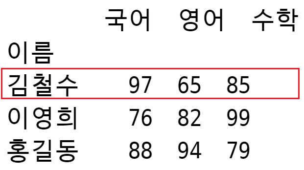

---
layout: single
title:  "1.판다스 엘셀 파일"
---  

## **1. 판다스 엘셀 파일**

<br/>

**[엑셀 파일 경로](https://github.com/loveinlove02/pandas03/tree/main/test)(test/exo1.xlsx)**

<br/>

파이썬에서 엑셀 파일을 사용하려면 openpyxl 모듈을 설치해야 합니다.  


<br/>

>## **pip install openpyxl**  

<br/>

Pandas로 엑셀 파일을 읽으려면 xlrd 모듈을 설치해야 합니다.  
<br/>

>## **pip install xlrd**  

<br/><br/>


## **판다스로 엑셀 파일 읽어오기**    

<br/>

```python
import pandas as pd

df = pd.read_excel('test/ex01.xlsx')
print(df)
```  

```
    이름  국어  영어  수학
0  김철수   97   65    85     
1  이영희   76   82    99     
2  홍길동   88   94    79
```  


<br/>


이 예제를 가지고 실행합니다.  

<br/>


## ***판다스로 엑셀 파일 읽어오기 1***  

<br/>

```python
import pandas as pd

df = pd.read_excel('test/ex01.xlsx')
print(df)

# 국어 점수를 모두가져온다.
# 열 레이블 이름 국어를 데이터 프레임에 인자로 넣는다.
print(df['국어'])
print(type(df['국어']))  # 시리즈


# 이름을 모두 가져온다.
# 열 레이블 이름 이름을 데이터 프레임에 인자로 넣는다.
print(df['이름'])
print(type(df['이름']))
```  

```
    이름  국어  영어  수학
0  김철수  97  65  85
1  이영희  76  82  99
2  홍길동  88  94  79


0    97
1    76
2    88
Name: 국어, dtype: int64
<class 'pandas.core.series.Series'>


0    김철수
1    이영희
2    홍길동

Name: 이름, dtype: object
<class 'pandas.core.series.Series'>
```  

<br/>


<br/>

## ***판다스로 엑셀 파일 읽어오기 2***  
***인덱스 설정***  

<br/>

```python
import pandas as pd

df = pd.read_excel('test/ex01.xlsx')
print(df)

# iloc는 행 번호(인덱스)로 접근합니다.
# 예제에서 이름(김철수, 이영희, 홍길동)이 행 번호 역할을 하기 때문에 
# 이것을 변경해야 합니다.

df.set_index('이름', inplace=True)  # 인덱스 설정
print(df)
```  

```
    이름  국어  영어  수학
0  김철수  97  65  85
1  이영희  76  82  99
2  홍길동  88  94  79


     국어  영어  수학
이름
김철수  97  65  85
이영희  76  82  99
홍길동  88  94  79
```  

<br/>


<br/>


## ***판다스로 엑셀 파일 읽어오기 3***  
***인덱스 설정***  

<br/>

## ***.loc 사용*** 


```python
import pandas as pd

df = pd.read_excel('test/ex01.xlsx')
df.set_index('이름', inplace=True)      # 인덱스 설정

print(df)

# loc. 행 이름을 사용해서 특정 행 가져오기
# 행 이름이 김철수
print(df.loc['김철수'])
print(type(df.loc['김철수']))   # 시리즈
```  

```
     국어  영어  수학
이름
김철수  97  65  85
이영희  76  82  99
홍길동  88  94  79


국어    97
영어    65
수학    85
Name: 김철수, dtype: int64
<class 'pandas.core.series.Series'>
```  

<br/>



<br/>


## ***판다스로 엑셀 파일 읽어오기 4***  
***인덱스 설정***  

<br/>

## ***.loc 사용, iloc 사용***  

<br/>

```python
import pandas as pd

df = pd.read_excel('test/ex01.xlsx')
df.set_index('이름', inplace=True)      # 인덱스 설정

print(df)

# loc.  행 이름을 사용해서 특정 행, 특정 열의 값 가져오기
# 이영희 행 이름, 영어 열 이름
print(df.loc['이영희', '영어'])

# iloc. 행 인덱스, 열 인덱스 사용.
# 행 인덱스 1, 열 인덱스 1
print(df.iloc[1, 1])
```  

```
     국어  영어  수학
이름
김철수  97  65  85
이영희  76  82  99
홍길동  88  94  79

82
82
```  

<br/>


<br/>

## ***판다스로 엑셀 파일 읽어오기 5***  
***인덱스 설정***  

<br/>

## ***.loc 사용(반복)***   

```python
import pandas as pd

df = pd.read_excel('test/ex01.xlsx')
df.set_index('이름', inplace=True)      # 인덱스 설정

print(df)

print(df.iloc[0])   # 행 인덱스 0번

# 반복문으로 모든 행 출력
for i in range(0, len(df), 1):
    print(df.iloc[i])
```  

```
     국어  영어  수학
이름
김철수  97  65  85
이영희  76  82  99
홍길동  88  94  79


국어    97
영어    65
수학    85
Name: 김철수, dtype: int64


국어    97
영어    65
수학    85
Name: 김철수, dtype: int64


국어    76
영어    82
수학    99
Name: 이영희, dtype: int64


국어    88
영어    94
수학    79
Name: 홍길동, dtype: int64
```  

<br/>


<br/>


## ***판다스로 엑셀 파일 읽어오기 6***  
***인덱스 설정***  

<br/>

## ***.iloc 사용(합계 구하기 1)***  

```python
import pandas as pd

df = pd.read_excel('test/ex01.xlsx')
df.set_index('이름', inplace=True)      # 인덱스 설정

print(df)

tot = []

# 김철수, 이영희, 홍길동의 점수 합계 구하기
for i in range(0, len(df), 1):
    s = 0
    
    for j in range(0, len(df.iloc[i]), 1):
        s = s + df.iloc[i][j]
        
    tot.append(s)

print(tot)
```  

```
     국어  영어  수학
이름
김철수  97  65  85
이영희  76  82  99
홍길동  88  94  79

[247, 257, 261]
```  

<br/>


## ***판다스로 엑셀 파일 읽어오기 7***  
***인덱스 설정***  

<br/>

## ***.iloc 사용(행, 열 값 출력)***  

```python
import pandas as pd

df = pd.read_excel('test/ex01.xlsx')
df.set_index('이름', inplace=True)      # 인덱스 설정

print(df)


for i in range(0, len(df), 1):
    print(df.iloc[i][0])    
    print(df.iloc[i][1])    
    print(df.iloc[i][2])  
```  

```
     국어  영어  수학
이름
김철수  97  65  85
이영희  76  82  99
홍길동  88  94  79

97
65
85
76
82
99
88
94
79
```  

<br/>


## ***판다스로 엑셀 파일 읽어오기 8***  
***인덱스 설정***  

<br/>

## ***.iloc 사용(합계 구하기 2, 평균)***  

```python
import pandas as pd

df = pd.read_excel('test/ex01.xlsx')
df.set_index('이름', inplace=True)      # 인덱스 설정

print(df)


tot = []
avg = []

for i in range(0, len(df), 1):
    tot.append(df.iloc[i].sum())
    avg.append(df.iloc[i].mean())

print(tot)
print(avg) 
```  

```
     국어  영어  수학
이름
김철수  97  65  85
이영희  76  82  99
홍길동  88  94  79

[247, 257, 261]
[82.33333333333333, 85.66666666666667, 87.0]
``` 

<br/>


## ***판다스로 엑셀 파일 읽어오기 9***  
***인덱스 설정***  

<br/>

## ***.iloc 사용***  
***총점, 평균을 리스트로 만들어서 데이터 프레임에 넣기***  

<br/>

```python
import pandas as pd

df = pd.read_excel('test/ex01.xlsx')
df.set_index('이름', inplace=True)      # 인덱스 설정

print(df)


tot = []
avg = []

for i in range(0, len(df), 1):
    tot.append(df.iloc[i].sum())
    avg.append(df.iloc[i].mean())


df['총점'] = tot
df['평균'] = avg

print(df)

df.to_excel('test/resul.xlsx')
```  

```
     국어  영어  수학
이름
김철수  97  65  85
이영희  76  82  99
홍길동  88  94  79

     국어  영어  수학   총점         평균
이름
김철수  97  65  85  247  82.333333
이영희  76  82  99  257  85.666667
홍길동  88  94  79  261  87.000000
```  

<br/>


